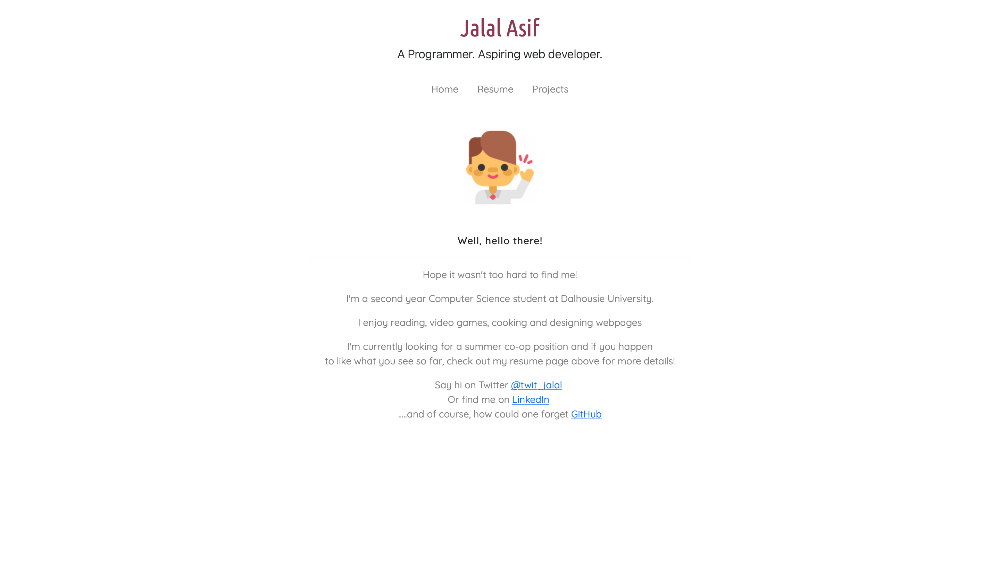
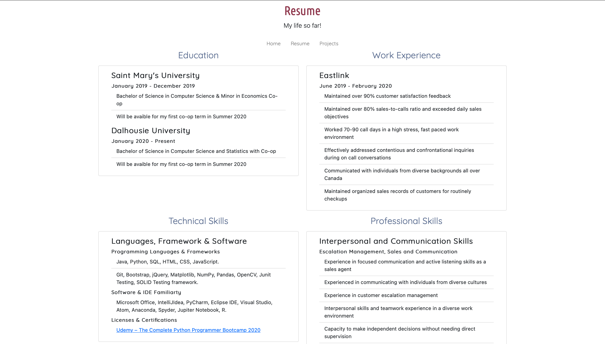
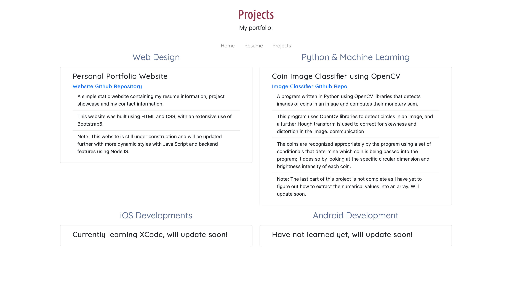

<h1>
Personal Portfolio Website
</h3>

<h4>Note: Link to the actual site: https://jalalasif.github.io/my-site/ </h4>

My first website, written from the ground up with HTML5, CSS3 and Bootstrap 5. Yet to learn animations with JS so its static for now; but future updates definitely inbound!

Screenshots demonstrating the layout:

<h3>Home</h3>

  
<h4>
Resume
</h4>
  

  
<h4>
Projects
</h4>
  

